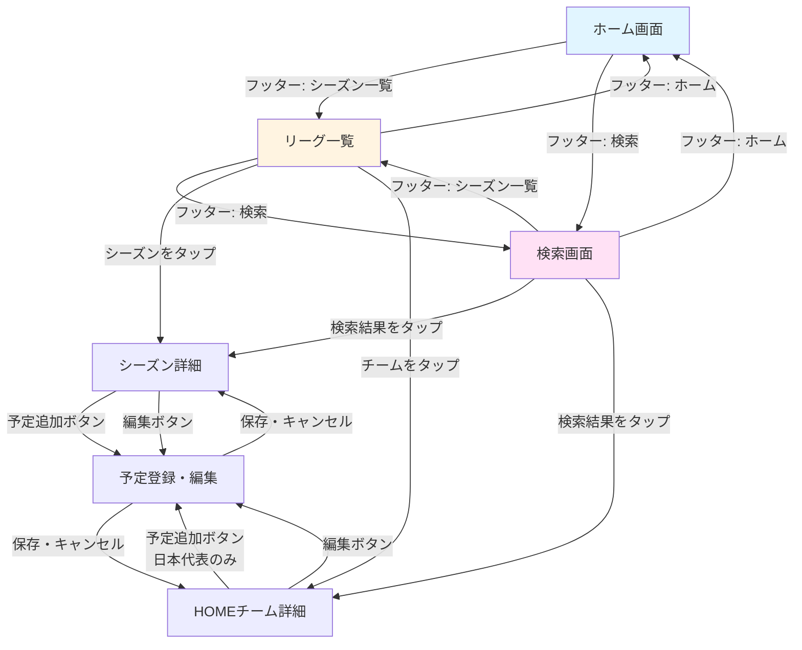
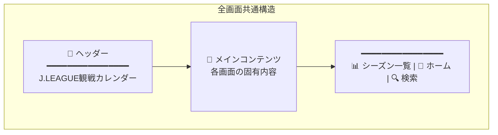
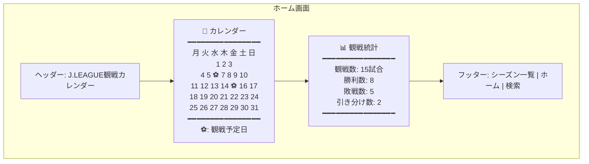
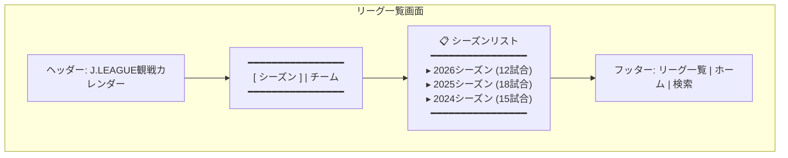
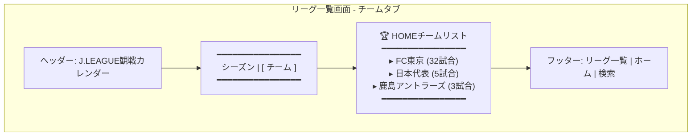
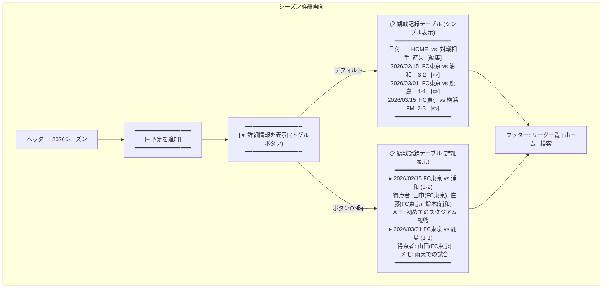
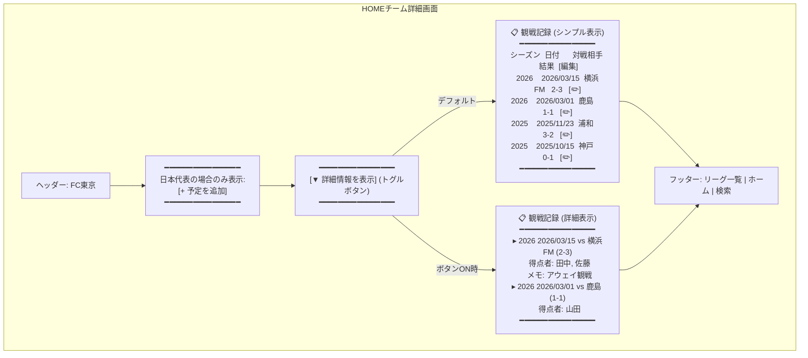
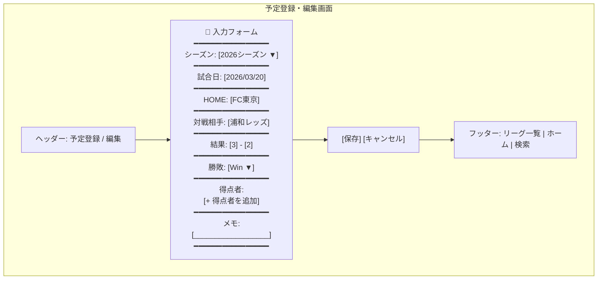
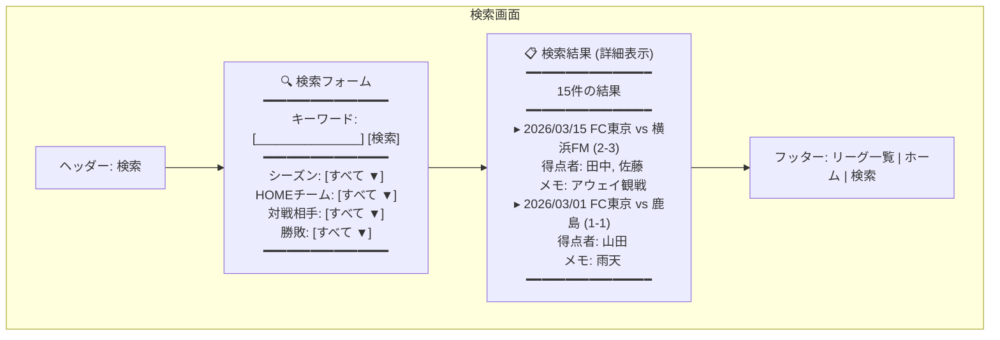

# J.LEAGUE観戦カレンダー 画面設計書

**作成日**: 2026-02-05
**形式**: Mermaid図 (ワイヤーフレーム)

---

## 📱 画面遷移図

---

## 🎨 全画面共通レイアウト

### 共通要素の仕様

| 要素 | 内容 | 備考 |
|------|------|------|
| **ヘッダー** | タイトル表示 | 固定表示「J.LEAGUE観戦カレンダー」 |
| **フッター** | ナビゲーションアイコン | シーズン一覧・ホーム（カレンダーアイコン）・検索の3つ |

---

## 🏠 ホーム画面

### 画面要素

| 要素 | 説明 |
|------|------|
| **カレンダー** | 月間カレンダー表示。観戦予定日にアイコン（⚽またはチームエンブレム）を表示 |
| **統計テーブル** | 全期間の観戦数、勝利数、敗戦数、引き分け数を表示 |

---

## 📊 リーグ一覧画面

### 画面要素

| 要素 | 説明 |
|------|------|
| **タブ切り替え** | シーズン / HOMEチーム の2つのタブ |
| **シーズンリスト** | 年度別のシーズンと試合数を表示。**日本代表は除外**（チームタブに表示）。タップで詳細画面へ |
| **チームリスト** | HOMEチーム別の観戦試合数を表示。日本代表を含む。タップで詳細画面へ |

---

## 📅 シーズン詳細画面

### 画面要素

| 要素 | 説明 |
|------|------|
| **予定追加ボタン** | タップで予定登録画面へ遷移 |
| **情報拡張ボタン** | トグルボタン。押すと得点者・メモなど詳細情報を表示/非表示切り替え |
| **観戦記録テーブル** | 日付、HOME、対戦相手、結果を一覧表示 **詳細モード**: 得点者、メモも表示 |
| **編集ボタン** | 各行の右端に配置。タップで編集画面へ |

---

## 🏆 HOMEチーム詳細画面

### 画面要素

| 要素 | 説明 |
|------|------|
| **予定追加ボタン** | 日本代表の場合のみ表示。Jリーグチームは各シーズンで管理 |
| **情報拡張ボタン** | トグルボタン。押すと得点者・メモなど詳細情報を表示/非表示切り替え |
| **観戦記録テーブル** | シーズンを横断した一覧。シーズン列を追加 **詳細モード**: 得点者、メモも表示 |
| **編集ボタン** | 各行の右端に配置 |

---

## ✏️ 予定登録・編集画面

### 画面要素（データモデルに対応）

| フィールド | 入力形式 | 必須 |
|------------|---------|------|
| **シーズン** | ドロップダウン | ✅ |
| **試合日** | 日付ピッカー | ✅ |
| **HOME** | テキスト入力 | ✅ |
| **対戦相手** | テキスト入力 | ✅ |
| **結果** | 数値入力 (スコア) | - |
| **勝敗** | ドロップダウン (Win/Lose/Draw) | - |
| **得点者** | 動的追加可能なリスト | - |
| **メモ** | 複数行テキスト | - |

---

## 🔍 検索画面

### 画面要素

| 要素 | 説明 |
|------|------|
| **検索フォーム** | キーワード、シーズン、チーム、対戦相手、勝敗でフィルタリング |
| **検索結果** | フォーム下部にリスト表示。**常に詳細情報（得点者・メモなど）を含めて表示**。タップで該当する詳細画面へ |

---

## 🎯 画面遷移の補足

### フッターナビゲーション
- **シーズン一覧**: シーズン/チームの一覧画面
- **ホーム**: カレンダーと統計を表示（カレンダーアイコン）
- **検索**: データ検索機能

### 編集フロー
1. シーズン詳細 / チーム詳細から「編集」をタップ
2. 予定登録・編集画面で内容を変更
3. 「保存」で元の画面に戻る

### 追加フロー
1. シーズン詳細 / チーム詳細（日本代表のみ）から「予定を追加」をタップ
2. 予定登録・編集画面で新規入力
3. 「保存」で元の画面に戻る

---

## 📐 レスポンシブ対応

PWAとして動作するため、以下の画面サイズに対応：

| デバイス | 対応 |
|----------|------|
| スマートフォン (縦) | ✅ メイン対象 |
| タブレット (縦/横) | ✅ 対応 |
| デスクトップ | △ 最小限対応 |

---

## 🚀 実装の優先順位

1. **Phase 1**: 全画面共通レイアウト + ホーム画面
2. **Phase 2**: リーグ一覧 + シーズン詳細
3. **Phase 3**: 予定登録・編集画面
4. **Phase 4**: HOMEチーム詳細 + 検索画面

---

## 💾 データモデルとの対応

既存のデータモデル（[lib/models/](lib/models/)）と画面の対応：

| 画面 | 使用モデル |
|------|-----------|
| ホーム画面 | `Season`, `MatchResult` (統計計算) |
| リーグ一覧 | `Season` |
| シーズン詳細 | `Season`, `MatchResult` |
| チーム詳細 | `MatchResult` (横断検索) |
| 予定登録・編集 | `Season`, `MatchResult`, `GoalScorer` |
| 検索 | すべてのモデル |

---

## 📝 補足事項

### カレンダーのアイコン表示
- **案1**: サッカーボール⚽（シンプル）
- **案2**: チームエンブレム（視覚的に分かりやすいが画像管理が必要）
- **推奨**: Phase 1ではサッカーボール、Phase 2以降でエンブレム対応

### 日本代表の扱い
- 「日本代表」を1つのシーズンとして扱う
- **シーズンリストには表示せず、チームリストのみに表示**
- HOMEチーム詳細画面では、日本代表の場合のみ予定追加ボタンを表示
- Jリーグチームの試合は各シーズンで管理

### 情報拡張機能
- **シーズン詳細画面**: トグルボタンで得点者・メモなどの詳細情報の表示/非表示を切り替え
- **HOMEチーム詳細画面**: トグルボタンで得点者・メモなどの詳細情報の表示/非表示を切り替え
- **検索画面**: 検索結果には常に詳細情報を含めて表示（トグル不要）

---

**作成者**: Claude Sonnet
**バージョン**: 1.4
**最終更新**: 2026-02-09

## 📝 変更履歴

### v1.4 (2026-02-09)
- Phase 3の実装完了：予定登録・編集画面
- 予定登録・編集画面（MatchFormScreen）の実装
  - 新規登録モード：シーズン詳細・日本代表のHOMEチーム詳細から遷移
  - 編集モード：試合一覧の編集ボタンから遷移
  - フォームバリデーション実装
  - 得点者の動的追加・削除（ダイアログUI）
  - 日本代表専用シーズンの自動作成機能
- シーズン詳細画面の予定追加・編集ボタンを実装
- HOMEチーム詳細画面の予定追加・編集ボタンを実装（日本代表のみ予定追加を表示）

### v1.3 (2026-02-06)
- Phase 2の実装完了：シーズン一覧・詳細・HOMEチーム詳細画面
- シーズン一覧画面（LeagueListScreen）の実装（シーズン/チームタブ）
- シーズン詳細画面（SeasonDetailScreen）の実装（詳細情報トグル機能付き）
- HOMEチーム詳細画面（TeamDetailScreen）の実装（日本代表判定機能付き）
- HomeScreenのナビゲーション実装

### v1.2 (2026-02-06)
- フッターナビゲーションの「リーグ一覧」を「シーズン一覧」に変更
- フッターの「ホーム」アイコンをカレンダーアイコンに変更

### v1.1 (2026-02-05)
- リーグ一覧のシーズンリストから日本代表を除外（チームタブのみに表示）
- シーズン詳細画面に情報拡張ボタンを追加
- HOMEチーム詳細画面に情報拡張ボタンを追加
- 検索結果を常に詳細表示に変更

### v1.0 (2026-02-05)
- 初版作成
